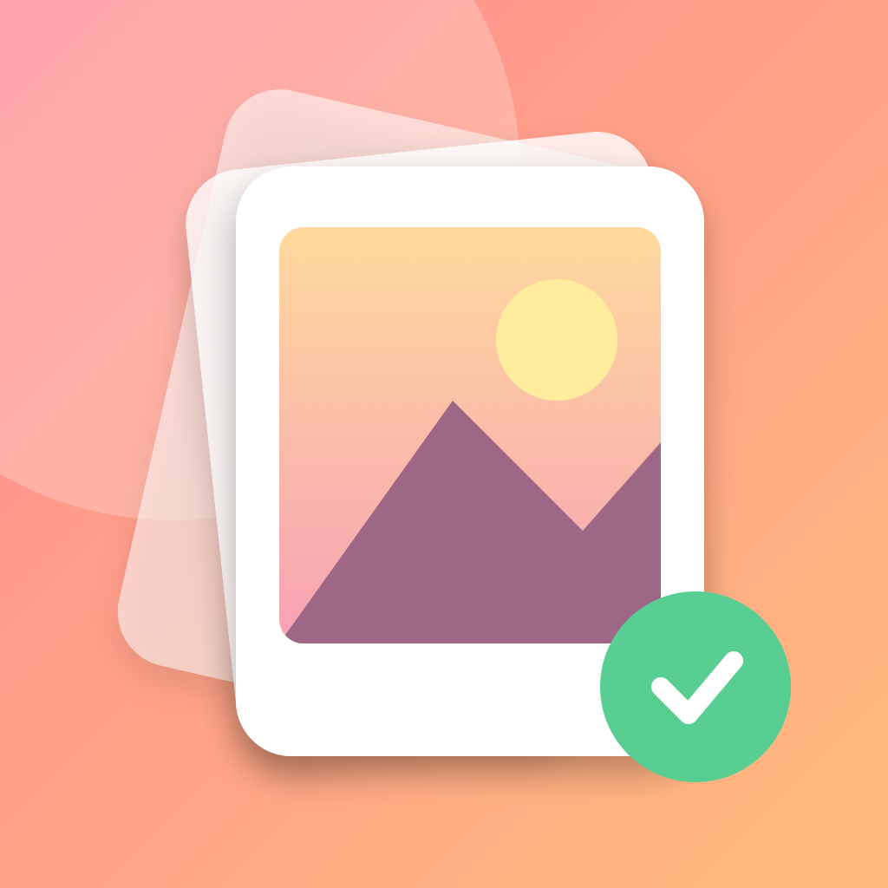
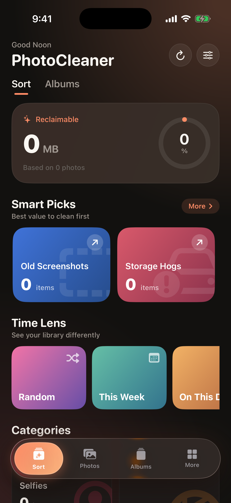
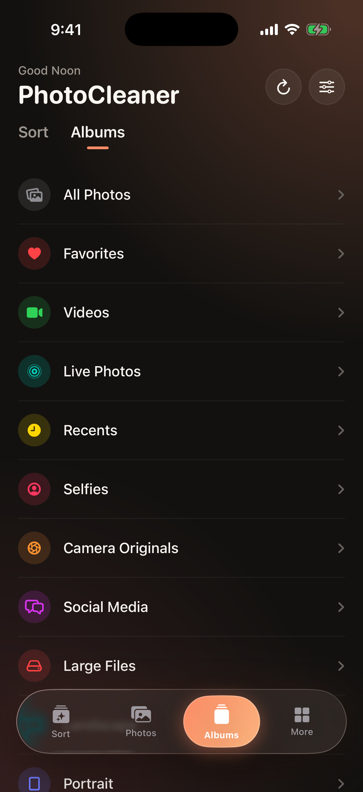
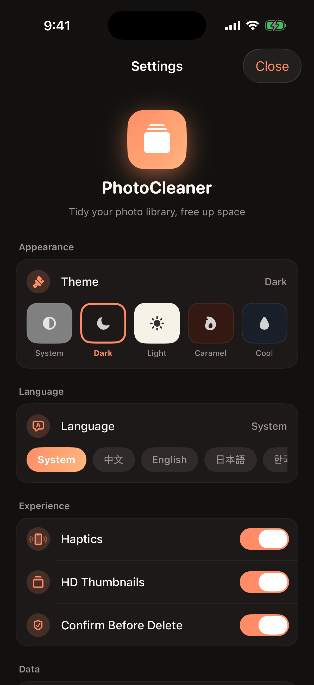

<p align="center">
  
</p>

<h1 align="center">PhotoCleaner</h1>

<p align="center"><a href="README.md">English</a> · <a href="README.zh.md">中文</a> · <b>日本語</b> · <a href="README.ko.md">한국어</a></p>

> Slidebox 風の iOS 写真整理ツール。SwiftUI ネイティブ、iOS 26 リキッドグラス。


## 機能

- 📷 システム写真ライブラリを読み込み、スマートアルバム + メタデータで分類
- 👉 **スワイプで確認**：左 = 次へ / 右 = 前へ / 上 = 削除予定に追加
- 🗑 **削除予定リスト** を一括確認 + iOS の標準削除ダイアログ
- ⏪ 1 ステップ取り消し
- 🖼 **写真ブラウザ**：フルスクリーン表示、ズーム、左右ページめくり、お気に入り / 共有 / 写真 App へジャンプ
- 📊 **メタデータ詳細**：サイズ、ファイル容量、種類、位置情報、長さ
- 💡 **おすすめ整理**：6 種類の入口（古いスクショ / 容量の大物 / 動画 / Live Photo / 自撮り / 低解像度画像）。ホーム横カード +「もっと」シートで全項目を一覧表示
- 🌗 **5 つのテーマ**：システム / ダーク / ライト / キャラメル / クール
- 🌐 **4 つの言語**：中文 / English / 日本語 / 한국어
- ⬆️ **新バージョン検出**：設定を開いたタイミングで静かに GitHub Releases を問い合わせ、新版があれば「について」セクションに目立つチップを表示
- ✨ iOS 26 リキッドグラス + 専用 AppIcon
- 🔒 完全に端末内処理、アップロード一切なし

## スクリーンショット

<p align="center">
  
  
  
</p>

> 左から右：おすすめ整理と Time Lens を備えたホーム · スマートアルバムと整理カテゴリを備えたアルバム · テーマ、言語、体験トグルを備えた設定。

## プロジェクト構造

[English README](README.md#project-structure) を参照（同じ）。

## シミュレータで実行

```bash
# Xcode 26+ と iOS Simulator runtime が必要
open PhotoCleaner.xcodeproj
# Xcode で ⌘R
```

## 未署名 IPA をビルド

```bash
bash scripts/build-ipa.sh
# 出力：build/PhotoCleaner-v<VERSION>.ipa
```

## 実機にインストール（開発者アカウント不要）

IPA は未署名。次のいずれかで無料 Apple ID で自己署名（証明書は 7 日間有効）：

### 方法 A：Sideloadly（最も簡単）
1. https://sideloadly.io をダウンロード
2. `build/PhotoCleaner-v<VERSION>.ipa` をドラッグ
3. 無料 Apple ID を入力
4. iPhone：設定 → 一般 → VPN とデバイス管理 → 証明書を信頼

### 方法 B：AltStore（自動更新）
AltServer をバックグラウンドで動かして 7 日証明書を自動更新

### 方法 C：Xcode 直接署名
Xcode でプロジェクトを開く → Signing → Team に無料 Apple ID を選択 → ⌘R で実機実行

## プライバシー

- すべての処理は端末内。**アップロード一切なし**
- `NSPhotoLibraryUsageDescription` のみ要求
- 削除時は iOS のシステムダイアログ。アプリは回避できません
- バージョン確認は `api.github.com` への単発 GET のみ。標準 User-Agent 以外の個人情報は送りません

## スポンサー

- [PayPal](https://paypal.me/zanwing)
- [Buy me a coffee](https://buymeacoffee.com/zanwing)
- [Wise](https://wise.com/pay/me/zhenyingm1)
- WeChat 投げ銭コードと Alipay QR は App の「設定 → スポンサー」で確認できます。

## リンク

- [公式サイト](https://zanwingmak.github.io/PhotoCleaner/)
- [更新履歴 CHANGELOG.md](CHANGELOG.md)
- [機能仕様 FEATURES.md](FEATURES.md)
- [テスト計画 TEST_PLAN.md](TEST_PLAN.md)
- [Releases](https://github.com/ZanwingMak/PhotoCleaner/releases)

## ライセンス

GPL-3.0-only
