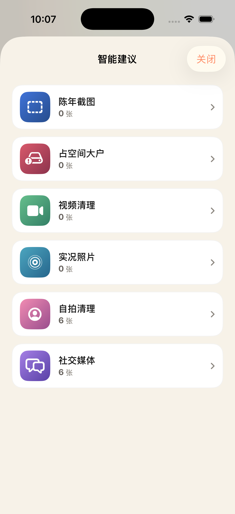

<p align="center">
  
</p>

<h1 align="center">PhotoCleaner</h1>

<p align="center"><a href="README.md">English</a> · <b>中文</b> · <a href="README.ja.md">日本語</a> · <a href="README.ko.md">한국어</a></p>

> 类 Slidebox 的 iOS 照片整理工具。SwiftUI 原生，iOS 26 液态玻璃语言。


## 功能

- 📷 读取系统照片库，按系统智能相册 + 元数据双重分类
- 👉 **滑动审核**：左滑下一张 / 右滑前一张 / 上滑加入待删除
- 🗑 **待删除列表** 批量确认 + 系统原生删除对话框
- ⏪ 单步撤销
- 🖼 **照片浏览器**：全屏大图、缩放、左右翻页、收藏 / 分享 / 跳转苹果照片 App
- 📊 **照片元数据**：尺寸、大小、类型、位置、时长完整展示
- 💡 **智能建议**：6 个清理切入点（陈年截图 / 占空间大户 / 视频 / 实况 / 自拍 / 社交媒体），首页横向卡 +「更多」全量列表
- 🌗 **5 种主题**：跟随系统 / 深色 / 浅色 / 焦糖暖 / 冷色调
- 🌐 **4 种语言**：中文 / English / 日本語 / 한국어
- ⬆️ **新版本检测**：进入设置后台静默查询 GitHub Releases，有新版直接在「关于」区高亮提示
- ✨ iOS 26 液态玻璃 + AppIcon
- 🔒 完全本地处理，零上传

## 截图

<p align="center">
  
  
  
</p>

> 从左到右：首页带新的「更多」胶囊 · 点开后弹出的「智能建议」完整列表 · 设置页展示 5 主题 + 4 语言。

## 项目结构

```
PhotoCleaner/
├── PhotoCleaner.xcodeproj
├── PhotoCleaner/
│   ├── PhotoCleanerApp.swift          应用入口 + RootShell（注入系统 colorScheme）
│   ├── Info.plist                     权限声明
│   ├── Models/PhotoCategory.swift     分类枚举
│   ├── Services/
│   │   ├── PhotoLibraryService.swift  PhotosKit 封装
│   │   ├── PhotoClassifier.swift      元数据推断
│   │   ├── ThemeManager.swift         主题管理
│   │   ├── LanguageManager.swift      语言管理
│   │   ├── L10n.swift                 翻译字典
│   │   └── UpdateChecker.swift        GitHub Releases 版本检测
│   ├── ViewModels/
│   └── Views/
│       ├── RootView.swift             权限分发
│       ├── CategoryListView.swift     首页（含智能建议「更多」sheet）
│       ├── SwipeReviewView.swift      滑动审核
│       ├── PendingDeletionView.swift  待删除列表
│       ├── PhotosBrowserView.swift    照片浏览器
│       ├── PhotoDetailView.swift      全屏大图
│       ├── PhotoMetadataSheet.swift   元数据详情
│       ├── SettingsView.swift         设置
│       └── Components/                通用组件
├── scripts/
│   ├── build-ipa.sh                   一键打包未签名 IPA
│   └── generate-icon.swift            AppIcon 生成器
├── CHANGELOG.md                       版本更新日志
├── FEATURES.md                        功能规格
├── TEST_PLAN.md                       测试用例
└── README.md                          英文版主 README
```

## 在模拟器运行

```bash
# 前置：Xcode 26+，已装 iOS Simulator runtime
open PhotoCleaner.xcodeproj
# 在 Xcode 里按 ⌘R 运行
```

## 打包未签名 IPA

```bash
bash scripts/build-ipa.sh
# 产物：build/PhotoCleaner-v<VERSION>.ipa
```

## 安装到真机（无开发者账号）

未签名 IPA 不能直接安装。选一种工具用免费 Apple ID 自签后侧载，证书 7 天有效：

### 方案 A：Sideloadly（最简单）
1. 下载 https://sideloadly.io
2. 把 `build/PhotoCleaner-v<VERSION>.ipa` 拖进去
3. 输入免费 Apple ID 自签
4. 在 iPhone「设置 → 通用 → VPN与设备管理」信任证书

### 方案 B：AltStore（可自动续期）
通过 AltServer 后台自动续期 7 天证书

### 方案 C：Xcode 直签
用 Xcode 打开工程，Signing 选你的免费 Apple ID，⌘R 运行到真机

## 隐私

- 所有处理本地完成，**零上传**
- 仅请求 `NSPhotoLibraryUsageDescription`
- 删除时由 iOS 系统弹原生确认对话框，应用无法绕过
- 版本检测只对 `api.github.com` 发起一次 GET，仅传 User-Agent，不携带任何个人信息

## 链接

- [更新日志 CHANGELOG.md](CHANGELOG.md)
- [功能文档 FEATURES.md](FEATURES.md)
- [测试用例 TEST_PLAN.md](TEST_PLAN.md)
- [Releases](https://github.com/ZanwingMak/PhotoCleaner/releases)

## 许可

GPL-3.0-only
